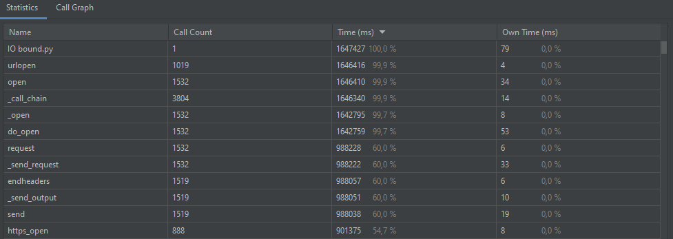
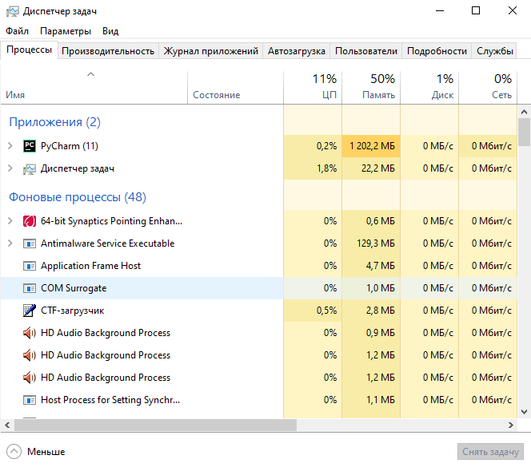
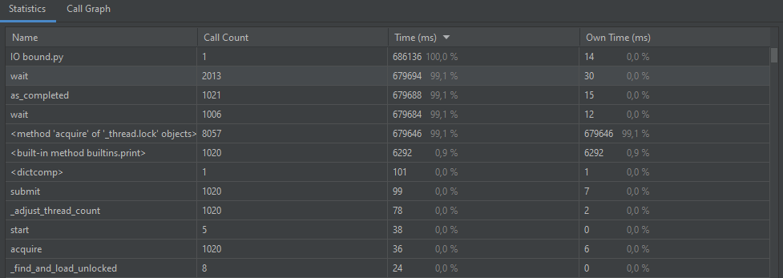
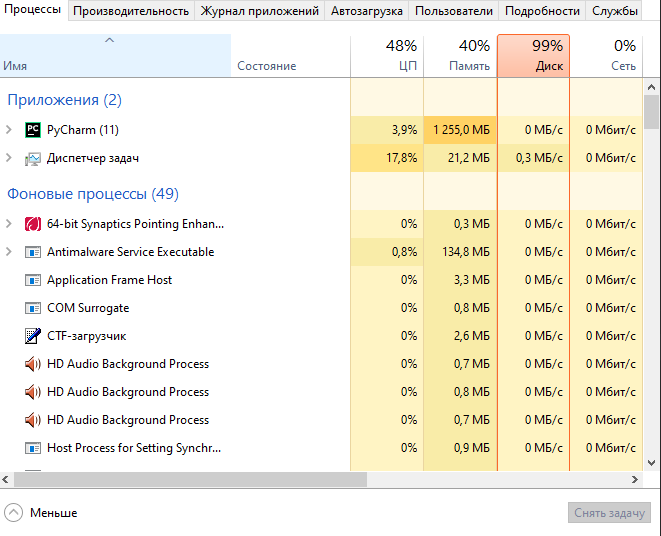
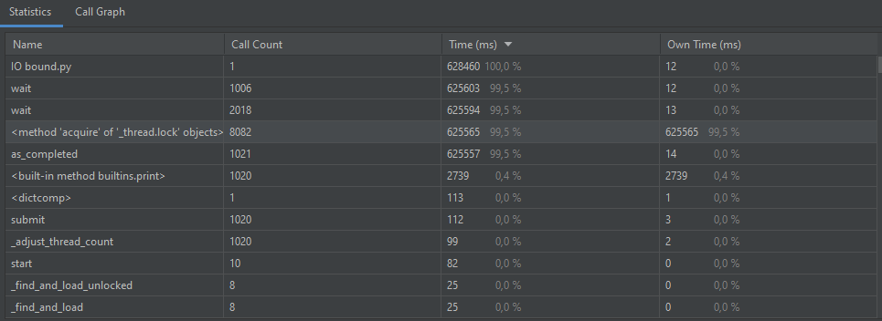
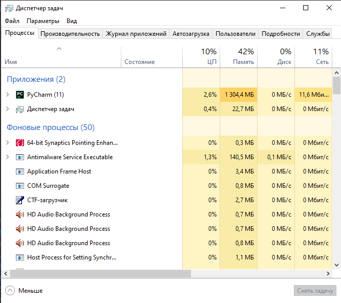
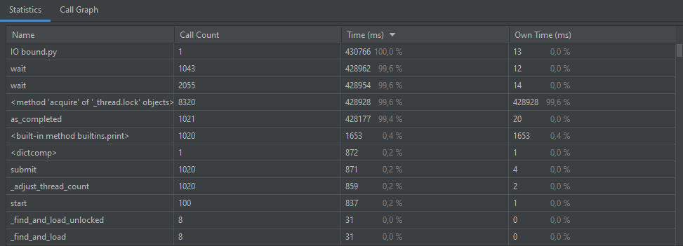
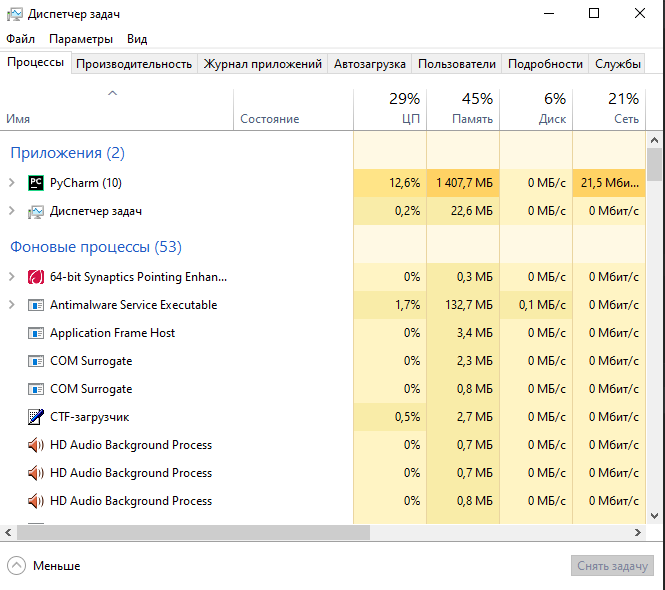

#IO-bound

## Выполнение синхронно в одни поток:
### Время выполнения:

### Диспетчер задач

## Выполнение используя ThreadPoolExecutor:
## max_workers = 5
### Время выполнения:

### Диспетчер задач

## max_workers = 10
### Время выполнения:

### Диспетчер задач

## max_workers = 100
### Время выполнения:

### Диспетчер задач

## При преобразованиях время выполнения уменьшается, а загрузка памяти отличается буквально на пару процентов, процессор(цп) в основном тоже одинаков, но бывают некие скачки и получается заметное отличие

#CPU-bound